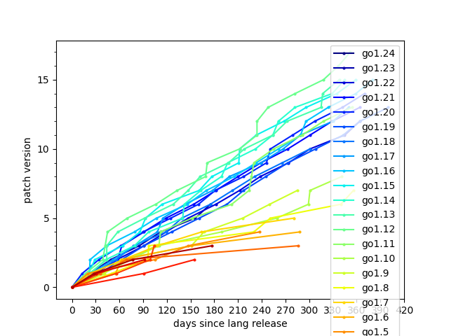
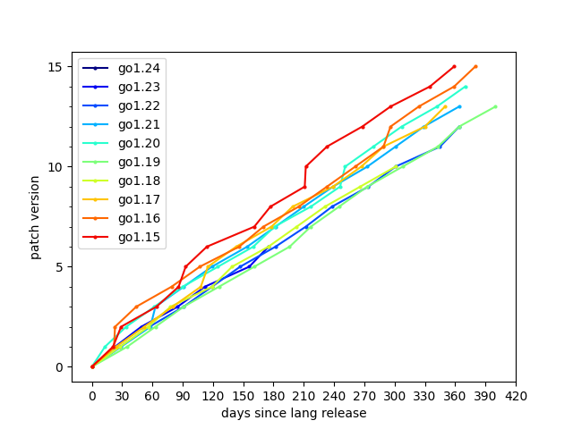

# stat-go-release

Statistic for [Go Release](https://go.dev/doc/devel/release).

local
```
go run main.go > release.csv
uv sync
uv run jupyter nbconvert --to notebook --execute --inplace release.ipynb
```

output




